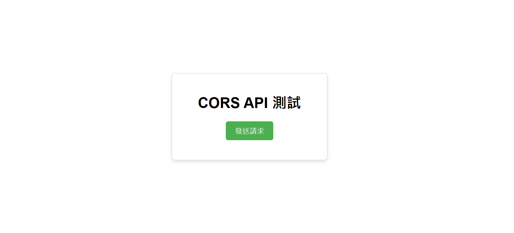
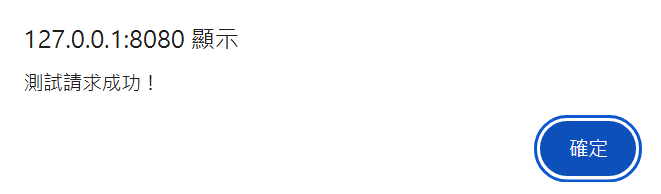
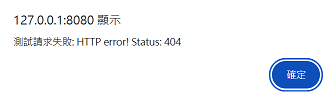

# CORS Test Request

用來測試後端服務是否開啟 CORS 的簡易前端瀏覽器。


## Overview
- Packages: npm v10.8.1

## Run

在程式內修改 `API` 成你想要測試的

### Install Module
```bash
npm install -g http-server
```

### Run
```bash
http-server -p 8080
```

服務運行在 `localhost:8000`

## UI

- 前端網頁


- 成功

- 失敗
